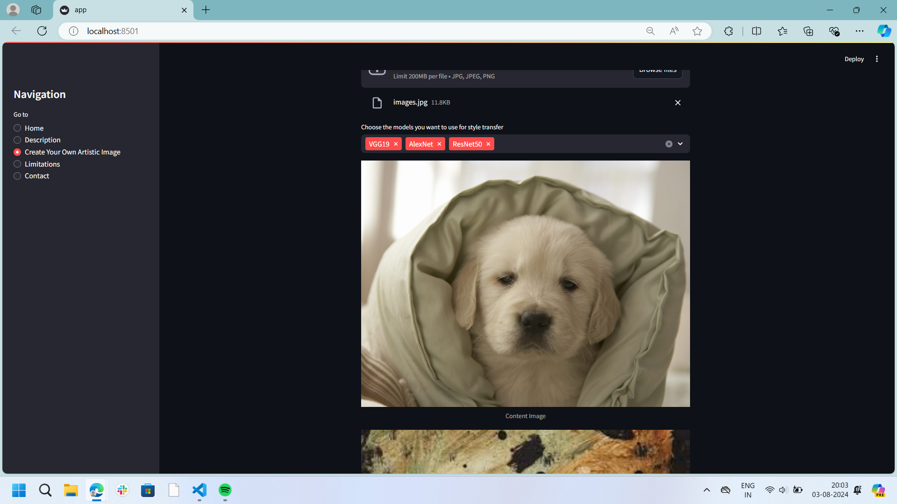

# Neural Style Transfer

This project focuses on the implementation of a Neural Style Transfer model to generate artistic images by combining the content of one image with the style of another. The project explores different architectural designs of the model, customizes its parameters, and experiments with various artistic styles.

## Streamlit Website

An interactive website has been built using Streamlit to make the neural style transfer process user-friendly. Users can upload a content image and a style image, select from three different deep learning models (VGG19, AlexNet, ResNet50), and generate artistic images.

### Website Features

- Upload a content image and a style image.
- Select the model for style transfer.
- Generate and view artistic images.
- Download the generated images.

### How to Use the Website

1. Navigate to the "Create Your Own Artistic Image" section.
2. Upload a content image and a style image.
3. Select the model you want to use for style transfer.
4. Click on "Generate Style Transfer" to see the output images generated by the selected models.
5. Download the generated images if you like them.

### Screenshots

Here are some screenshots of the website:

#### Home Page

#### Description Page

#### Create Your Own Artistic Image

## Examples 

### Example 1
#### Input Images:
##### Content Image: 

##### Style Image:

#### Output Image
##### Output from VGG19 Model

##### Output from AlexNet Model

### Example 2
#### Input Images:
##### Content Image: 

##### Style Image:

#### Output Image
##### Output from VGG19 Model

##### Output from AlexNet Model

### Limitations

- **Image Size Requirement**: Both content and style images must have the same dimensions for the style transfer to work properly. If the images have different sizes, you may need to resize them before uploading.
- **ResNet50 Model Issue**: The ResNet50 model may sometimes encounter issues due to normalization and matrix multiplication. If you experience problems with this model, you might want to try using VGG19 or AlexNet instead.

### About Us

**Contact Information:**

- **Name**: Prerna Pattanaik
- **Email**: [ucse21061@stu.xim.edu.in](mailto:ucse21061@stu.xim.edu.in)
- **GitHub**: [github.com/whyprerna](https://github.com/whyprerna)
- **LinkedIn**: [linkedin.com/in/pattanaikprerna](https://www.linkedin.com/in/pattanaikprerna/)

---

### Project Description (Resume)

**Artistic Image Fusion with Deep Learning**

- Led the development of an interactive Streamlit website for Neural Style Transfer, integrating three deep learning models (VGG19, AlexNet, ResNet50). Demonstrated proficiency in leveraging these models to transform images into visually compelling artworks, showcasing a nuanced understanding of content and artistic style.

---

### Additional Information

- This project is implemented using PyTorch for deep learning models.
- The interactive website is built using Streamlit.

Feel free to explore the repository and try out the website!
